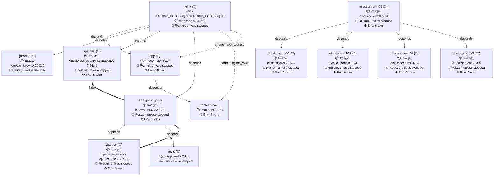
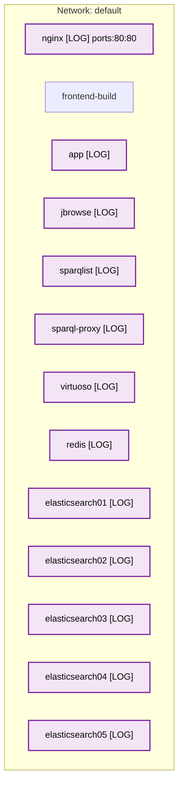
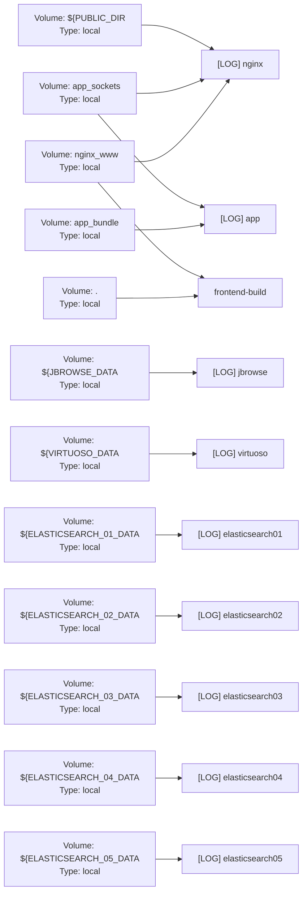

# Docker Compose Service Architecture

## Legend
- **→** Dependency connection (depends_on)
- **⇢** Shared volume connection (bind mounts)
- **⇨** Service-to-service connection (environment variables)
- **💓** Service has healthcheck configured
- **📝** Service has logging configured
- **Red dashed nodes** External services (not in current stack)

# Network Topology

## Network Topology Legend
- **HC** = Healthcheck configured
- **LOG** = Logging configured
- **Blue nodes** = Services with healthcheck
- **Purple nodes** = Services with logging
- **Green nodes** = Services with both healthcheck and logging
- **Dashed lines** = Same service across multiple networks

# Resource Allocation & Volumes

## Resource Limits

## Volume Sharing

## Resource Overview Legend
- **HC** = Healthcheck configured
- **LOG** = Logging configured

# Service Details

## nginx (📝)

**📦 Image:** nginx:1.25.2

**🔄 Restart Policy:** unless-stopped

**🔌 Ports:** ${NGINX_PORT:-80}:80:${NGINX_PORT:-80}:80

**🔗 Dependencies:** app, jbrowse, sparqlist, sparql-proxy

**📁 Shares Volumes With:**
- frontend-build (nginx_www)
- app (app_sockets)

**📁 Volumes (6):**
- 🗂️ Bind Mount: `./docker/nginx/cache.sh` → `/usr/local/bin/cache` (ro)
- 🗂️ Bind Mount: `./docker/nginx/nginx.conf` → `/etc/nginx/nginx.conf` (ro)
- 🗂️ Bind Mount: `./docker/nginx/production.conf` → `/etc/nginx/conf.d/default.conf` (ro)
- 📦 Named Volume: `${PUBLIC_DIR` → `?}` (/var/www/public)
- 📦 Named Volume: `app_sockets` → `/tmp/sockets` (ro)
- 📦 Named Volume: `nginx_www` → `/var/www`

**📝 Logging:** json-file
  - max-size: 1m
  - max-file: 1

---

## frontend-build

**📦 Image:** node:18

**📁 Shares Volumes With:**
- nginx (nginx_www)

**⚙️ Environment Variables (7):**
- `TOGOVAR_REFERENCE`: ${TOGOVAR_REFERENCE:?}
- `TOGOVAR_FRONTEND_API_URL`: ${TOGOVAR_FRONTEND_API_URL:-https://togovar.org}
- `TOGOVAR_FRONTEND_STANZA_URL`: ${TOGOVAR_FRONTEND_STANZA_URL:-https://togovar.org...
- `TOGOVAR_ENDPOINT_SPARQL`: ${TOGOVAR_ENDPOINT_SPARQL:-https://togovar.org/spa...
- `TOGOVAR_ENDPOINT_SEARCH`: ${TOGOVAR_ENDPOINT_SEARCH:-https://togovar.org/sea...
- `TOGOVAR_ENDPOINT_SPARQLIST`: ${TOGOVAR_ENDPOINT_SPARQLIST:-https://togovar.org/...
- `TOGOVAR_ENDPOINT_JBROWSE`: ${TOGOVAR_ENDPOINT_JBROWSE:-https://togovar.org/jb...

**📁 Volumes (3):**
- 📦 Named Volume: `.` → `/work`
- 🗂️ Bind Mount: `./docker/frontend-build/docker-entrypoint.sh` → `/docker-entrypoint.sh` (ro)
- 📦 Named Volume: `nginx_www` → `/var/www`

---

## app (📝)

**📦 Image:** ruby:3.2.4

**🔄 Restart Policy:** unless-stopped

**🔗 Dependencies:** frontend-build

**📁 Shares Volumes With:**
- nginx (app_sockets)

**⚙️ Environment Variables (18):**
- `RAILS_ENV`: production
- `WEB_CONCURRENCY`: 10
- `SECRET_KEY_BASE`: ${SECRET_KEY_BASE:?}
- `TOGOVAR_ELASTICSEARCH_HOST`: elasticsearch01:9200
- `TOGOVAR_REFERENCE`: ${TOGOVAR_REFERENCE:?}
- `TOGOVAR_FRONTEND_API_URL`: ${TOGOVAR_FRONTEND_API_URL:-https://togovar.org}
- `TOGOVAR_ENDPOINT_SPARQL`: ${TOGOVAR_ENDPOINT_SPARQL:-https://togovar.org/spa...
- `TOGOVAR_REDIS_HOST`: redis
- `TOGOVAR_REDIS_PORT`: 6379
- `TOGOVAR_REDIS_SESSION_EXPIRE`: ${TOGOVAR_REDIS_SESSION_EXPIRE:-86400}
- `TOGOVAR_KEYCLOAK_URL`: ${TOGOVAR_KEYCLOAK_URL:-}
- `TOGOVAR_KEYCLOAK_CLIENT_SECRET`: ${TOGOVAR_KEYCLOAK_CLIENT_SECRET:-}
- `TOGOVAR_KEYCLOAK_BASE_URL`: ${TOGOVAR_KEYCLOAK_BASE_URL:-}
- `TOGOVAR_KEYCLOAK_REALM`: ${TOGOVAR_KEYCLOAK_REALM:-}
- `TOGOVAR_KEYCLOAK_CLIENT_ID`: ${TOGOVAR_KEYCLOAK_CLIENT_ID:-}
- `TOGOVAR_KEYCLOAK_AUTHORIZE_SCOPE`: ${TOGOVAR_KEYCLOAK_AUTHORIZE_SCOPE:-}
- `TOGOVAR_KEYCLOAK_AUTH_ATTRIBUTE_NAME`: ${TOGOVAR_KEYCLOAK_AUTH_ATTRIBUTE_NAME:-}
- `TOGOVAR_KEYCLOAK_AUTH_ATTRIBUTE_REGEX`: ${TOGOVAR_KEYCLOAK_AUTH_ATTRIBUTE_REGEX:-}

**📁 Volumes (4):**
- 🗂️ Bind Mount: `./docker/ruby/docker-entrypoint.sh` → `/docker-entrypoint.sh` (ro)
- 🗂️ Bind Mount: `./backend` → `/app`
- 📦 Named Volume: `app_bundle` → `/usr/local/bundle`
- 📦 Named Volume: `app_sockets` → `/app/tmp/sockets`

**📝 Logging:** json-file
  - max-size: 1m
  - max-file: 1

---

## jbrowse (📝)

**📦 Image:** togovar_jbrowse:2022.2

**🔄 Restart Policy:** unless-stopped

**📁 Volumes (2):**
- 🗂️ Bind Mount: `./docker/jbrowse/template/jbrowse_conf.json` → `/var/www/jbrowse_conf.json` (ro)
- 📦 Named Volume: `${JBROWSE_DATA` → `?}` (/var/www/data)

**📝 Logging:** json-file
  - max-size: 1m
  - max-file: 1

---

## sparqlist (📝)

**📦 Image:** ghcr.io/dbcls/sparqlist:snapshot-f444cf1

**🔄 Restart Policy:** unless-stopped

**🔄 Connects To:**
- **sparql-proxy** via http

**⚙️ Environment Variables (5):**
- `ADMIN_PASSWORD`: ${SPARQLIST_ADMIN_PASSWORD:?}
- `SPARQLIST_TOGOVAR_URL`: ${TOGOVAR_FRONTEND_API_URL:-https://stg-togovar.or...
- `SPARQLIST_TOGOVAR_APP`: http://nginx
- `SPARQLIST_TOGOVAR_SPARQL`: http://sparql-proxy:3000/proxy/sparql
- `SPARQLIST_TOGOVAR_SPARQLIST`: http://sparqlist:3000/sparqlist

**📁 Volumes (1):**
- 🗂️ Bind Mount: `./sparqlist` → `/app/repository`

**📝 Logging:** json-file
  - max-size: 1m
  - max-file: 1

---

## sparql-proxy (📝)

**📦 Image:** togovar_proxy:2023.1

**🔄 Restart Policy:** unless-stopped

**🔗 Dependencies:** virtuoso, redis

**🔄 Connects To:**
- **virtuoso** via http

**🔄 Connected From:**
- **sparqlist** via http

**⚙️ Environment Variables (7):**
- `SPARQL_BACKEND`: http://virtuoso:8890/sparql
- `ADMIN_USER`: admin
- `ADMIN_PASSWORD`: ${SPARQL_PROXY_ADMIN_PASSWORD:?}
- `CACHE_STORE`: redis
- `REDIS_URL`: redis://redis:6379
- `MAX_CONCURRENCY`: 50
- `PASSTHROUGH`: true

**📝 Logging:** json-file
  - max-size: 1m
  - max-file: 1

---

## virtuoso (📝)

**📦 Image:** openlink/virtuoso-opensource-7:7.2.12

**🔄 Restart Policy:** unless-stopped

**🔄 Connected From:**
- **sparql-proxy** via http

**⚙️ Environment Variables (9):**
- `DBA_PASSWORD`: dba
- `SPARQL_UPDATE`: false
- `DEFAULT_GRAPH`: http://togovar.org
- `VIRT_SPARQL_MaxQueryCostEstimationTime`: *set*
- `VIRT_SPARQL_MaxQueryExecutionTime`: 600
- `VIRT_SPARQL_ResultSetMaxRows`: 1000000
- `VIRT_URIQA_DefaultHost`: togovar.org
- `VIRT_Parameters_NumberOfBuffers`: 1360000
- `VIRT_Parameters_MaxDirtyBuffers`: 1000000

**📁 Volumes (1):**
- 📦 Named Volume: `${VIRTUOSO_DATA` → `?}` (/database)

**📝 Logging:** json-file
  - max-size: 1m
  - max-file: 1

---

## redis (📝)

**📦 Image:** redis:7.2.1

**🔄 Restart Policy:** unless-stopped

**📝 Logging:** json-file
  - max-size: 1m
  - max-file: 1

---

## elasticsearch01 (📝)

**📦 Image:** elasticsearch:8.13.4

**🔄 Restart Policy:** unless-stopped

**🔗 Dependencies:** elasticsearch02, elasticsearch03, elasticsearch04, elasticsearch05

**⚙️ Environment Variables (9):**
- `ES_JAVA_OPTS`: ${ELASTICSEARCH_JAVA_OPTS:--Xms16g -Xmx16g}
- `TAKE_FILE_OWNERSHIP`: true
- `node.name`: node01
- `cluster.initial_master_nodes`: node01,node02,node03,node04,node05
- `discovery.seed_hosts`: elasticsearch02,elasticsearch03,elasticsearch04,el...
- `bootstrap.memory_lock`: true
- `xpack.monitoring.collection.enabled`: true
- `xpack.security.enabled`: false
- `path.repo`: /usr/share/elasticsearch/snapshot

**📁 Volumes (1):**
- 📦 Named Volume: `${ELASTICSEARCH_01_DATA` → `?}` (/usr/share/elasticsearch/data)

**⚡ Ulimits:** nofile

**📝 Logging:** json-file
  - max-size: 1m
  - max-file: 1

---

## elasticsearch02 (📝)

**📦 Image:** elasticsearch:8.13.4

**🔄 Restart Policy:** unless-stopped

**⚙️ Environment Variables (9):**
- `ES_JAVA_OPTS`: ${ELASTICSEARCH_JAVA_OPTS:--Xms16g -Xmx16g}
- `TAKE_FILE_OWNERSHIP`: true
- `node.name`: node02
- `cluster.initial_master_nodes`: node01,node02,node03,node04,node05
- `discovery.seed_hosts`: elasticsearch01,elasticsearch03,elasticsearch04,el...
- `bootstrap.memory_lock`: true
- `xpack.monitoring.collection.enabled`: true
- `xpack.security.enabled`: false
- `path.repo`: /usr/share/elasticsearch/snapshot

**📁 Volumes (1):**
- 📦 Named Volume: `${ELASTICSEARCH_02_DATA` → `?}` (/usr/share/elasticsearch/data)

**⚡ Ulimits:** nofile

**📝 Logging:** json-file
  - max-size: 1m
  - max-file: 1

---

## elasticsearch03 (📝)

**📦 Image:** elasticsearch:8.13.4

**🔄 Restart Policy:** unless-stopped

**⚙️ Environment Variables (9):**
- `ES_JAVA_OPTS`: ${ELASTICSEARCH_JAVA_OPTS:--Xms16g -Xmx16g}
- `TAKE_FILE_OWNERSHIP`: true
- `node.name`: node03
- `cluster.initial_master_nodes`: node01,node02,node03,node04,node05
- `discovery.seed_hosts`: elasticsearch01,elasticsearch02,elasticsearch04,el...
- `bootstrap.memory_lock`: true
- `xpack.monitoring.collection.enabled`: true
- `xpack.security.enabled`: false
- `path.repo`: /usr/share/elasticsearch/snapshot

**📁 Volumes (1):**
- 📦 Named Volume: `${ELASTICSEARCH_03_DATA` → `?}` (/usr/share/elasticsearch/data)

**⚡ Ulimits:** nofile

**📝 Logging:** json-file
  - max-size: 1m
  - max-file: 1

---

## elasticsearch04 (📝)

**📦 Image:** elasticsearch:8.13.4

**🔄 Restart Policy:** unless-stopped

**⚙️ Environment Variables (9):**
- `ES_JAVA_OPTS`: ${ELASTICSEARCH_JAVA_OPTS:--Xms16g -Xmx16g}
- `TAKE_FILE_OWNERSHIP`: true
- `node.name`: node04
- `cluster.initial_master_nodes`: node01,node02,node03,node04,node05
- `discovery.seed_hosts`: elasticsearch01,elasticsearch02,elasticsearch03,el...
- `bootstrap.memory_lock`: true
- `xpack.monitoring.collection.enabled`: true
- `xpack.security.enabled`: false
- `path.repo`: /usr/share/elasticsearch/snapshot

**📁 Volumes (1):**
- 📦 Named Volume: `${ELASTICSEARCH_04_DATA` → `?}` (/usr/share/elasticsearch/data)

**⚡ Ulimits:** nofile

**📝 Logging:** json-file
  - max-size: 1m
  - max-file: 1

---

## elasticsearch05 (📝)

**📦 Image:** elasticsearch:8.13.4

**🔄 Restart Policy:** unless-stopped

**⚙️ Environment Variables (9):**
- `ES_JAVA_OPTS`: ${ELASTICSEARCH_JAVA_OPTS:--Xms16g -Xmx16g}
- `TAKE_FILE_OWNERSHIP`: true
- `node.name`: node05
- `cluster.initial_master_nodes`: node01,node02,node03,node04,node05
- `discovery.seed_hosts`: elasticsearch01,elasticsearch02,elasticsearch03,el...
- `bootstrap.memory_lock`: true
- `xpack.monitoring.collection.enabled`: true
- `xpack.security.enabled`: false
- `path.repo`: /usr/share/elasticsearch/snapshot

**📁 Volumes (1):**
- 📦 Named Volume: `${ELASTICSEARCH_05_DATA` → `?}` (/usr/share/elasticsearch/data)

**⚡ Ulimits:** nofile

**📝 Logging:** json-file
  - max-size: 1m
  - max-file: 1

---

# Service Connection Summary

## All Service-to-Service Connections

- **sparqlist** → **sparql-proxy** via `http`
- **sparql-proxy** → **virtuoso** via `http`

## Shared Volume Summary

- **nginx** ↔ **frontend-build** share volumes: `nginx_www`
- **nginx** ↔ **app** share volumes: `app_sockets`

# Volumes

## 📁 app_bundle
**Driver:** local
**Used by:** app

## 📁 app_sockets
**Driver:** local
**Used by:** nginx, app

## 📁 nginx_www
**Driver:** local
**Used by:** nginx, frontend-build
